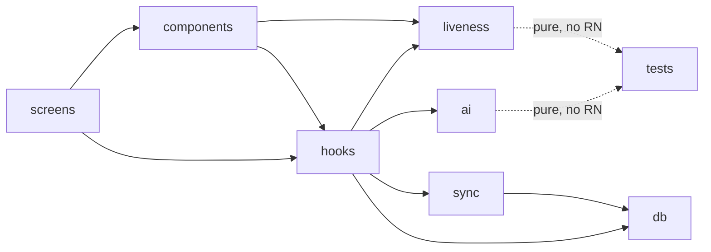

# Integration Guide — drop DatalakeFaceAuth into an existing React Native app

How to add offline face recognition + liveness + sync-and-purge to an existing
RN app (e.g. **Datalake 3.0**). Target: RN ≥ 0.81 with the New Architecture.
Estimated time: ~30–45 min.

---

## 0. Prerequisites

- React Native **New Architecture** enabled (`newArchEnabled=true`), Hermes on.
- Android `minSdk 26`, JDK **17**. iOS deployment target **15.1+**, CocoaPods.
- A front camera + camera permission strings.

---

## 1. Install peer dependencies

```bash
npm install \
  react-native-vision-camera@4.7.3 \
  vision-camera-resize-plugin@^3.2.0 \
  react-native-worklets-core@^1.6.3 \
  react-native-fast-tflite@^3.0.1 \
  react-native-nitro-modules@^0.35.9 \
  @op-engineering/op-sqlite@^16.2.0 \
  @react-native-community/netinfo@^12.0.1 \
  zustand@^5

# Babel worklet plugins required by worklets-core 1.6.3
npm install -D \
  @babel/preset-typescript \
  @babel/plugin-proposal-optional-chaining \
  @babel/plugin-proposal-nullish-coalescing-operator
```

> **Pin vision-camera to 4.7.3.** v5 is a Nitro rewrite that removed the
> `useFrameProcessor` API the plugin ecosystem (fast-tflite, resize-plugin) needs.

## 2. Configure the build

**`babel.config.js`** — add the worklets plugin **last** and the proposal plugins:
```js
plugins: [
  '@babel/plugin-proposal-optional-chaining',
  '@babel/plugin-proposal-nullish-coalescing-operator',
  'react-native-worklets-core/plugin', // must be last
]
```

**`package.json`** — enable SQLCipher in op-sqlite:
```json
"op-sqlite": { "sqlcipher": true }
```

**`metro.config.js`** — allow `.tflite` as an asset:
```js
config.resolver.assetExts.push('tflite');
```

**Permissions** — `NSCameraUsageDescription` (iOS Info.plist) and
`<uses-permission android:name="android.permission.CAMERA"/>` (AndroidManifest).

## 3. Copy the modules

Copy these folders into the host app's `src/` (they're framework-agnostic TS):

| Folder | Purpose | External coupling |
|--------|---------|-------------------|
| `src/ai/` | blazeface, facemesh (+alignment), antispoof, embedding, preprocessing | none (pure + worklet) |
| `src/liveness/` | challenge FSM + thresholds config | none (pure) |
| `src/db/` | SQLCipher schema + enrollment/attendance CRUD | op-sqlite |
| `src/sync/` | backoff, push (retry+idempotency), sync-and-purge | netinfo, db |
| `src/hooks/` | useLiveness · useEnrollment · useRecognition · useCameraAccess · useIsOnline | vision-camera, fast-tflite |
| `src/components/` | LivenessCamera · LivenessOverlay (optional UI) | — |
| `models/` | the 4 `.tflite` assets + manifest | bundled |

Then `npm run fetch:models` (or copy the `models/` folder) so the assets exist.

## 4. Use it from a Datalake 3.0 screen

**Option A — drop-in UI:**
```tsx
import { LivenessCamera } from './ai-attendance/components';
// renders the full passive-gate → challenges → recognition flow
<LivenessCamera />
```

**Option B — wire into your own UI with the hooks:**
```tsx
const { frameProcessor, liveness, prompt, models } = useLiveness();
const { onLivenessUpdate, phase, result } = useRecognition();
useEffect(() => onLivenessUpdate(liveness), [liveness]);
// result.match → { personId, displayName, score, accepted }
// feed result into your existing attendance/HR domain
```

**Enrollment:**
```tsx
const { frameProcessor, phase, captured, total, start } = useEnrollment();
start(personId, displayName); // captures 7 frames → encrypted embedding
```

## 5. Storage key (production hardening)

`src/db/index.ts` opens SQLCipher with a key. Replace the dev placeholder with a
Keystore/Keychain-derived secret (e.g. `react-native-keychain`), then call
`getDb(secret)` once at startup. **Never** hardcode or bundle the key.

## 6. Sync endpoint

Point `DEFAULT_SYNC_CONFIG.endpointUrl` (`src/sync/config.ts`) at:
- your **Datalake 3.0 API** (implement the same idempotent `POST /attendance`
  contract — see `infra/src/handler.mjs`), **or**
- the provided **AWS SAM stack**: `cd infra && sam build && sam deploy --guided`, **or**
- the **local mock** for demos: `node mock-server/server.mjs`.

The sync layer is transport-only JSON + idempotency keys, so it maps onto any
existing ingestion endpoint with a thin adapter.

## 7. Verify the integration

```bash
npx tsc --noEmit     # types resolve in the host app
npm test             # the AI/liveness/sync logic tests pass
npm run verify:models # ≤ 20 MB
```

---

### Module dependency map



`ai/` and `liveness/` are pure TypeScript (no React/RN imports) — the reason the
math is unit-tested without a device and ports cleanly into any RN host.
