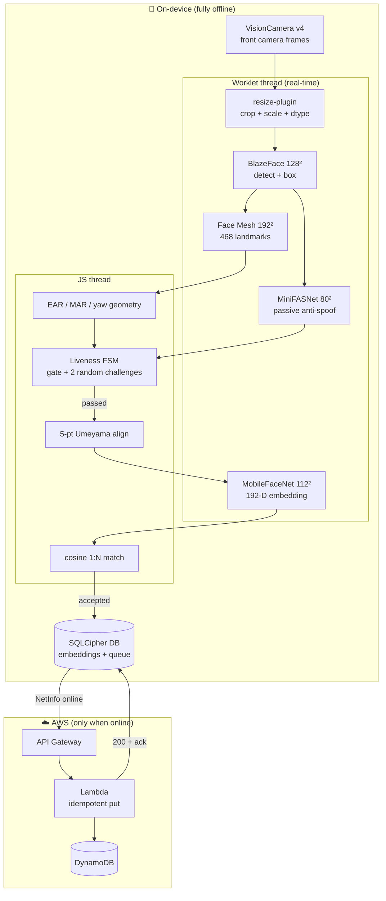

# Technical Documentation — DatalakeFaceAuth

Offline, on-device face recognition + liveness for attendance, with
opportunistic encrypted sync to AWS. This document covers the model
architecture, data flow, liveness logic, security/encryption model, integration
into an existing **Datalake 3.0** React Native app, and performance benchmarks.

---

## 1. System architecture



**Why this shape:** UI / AI / storage / sync are independent modules. All AI
math (decode, NMS, EAR/MAR/pose, alignment, cosine, softmax) is **pure +
`'worklet'`** so it runs inside the frame processor *and* is unit-tested in Node
without a device — 56 tests, 8 suites.

---

## 2. Model architecture & footprint

| Stage | Model | Input | Output | License | Size |
|-------|-------|-------|--------|---------|------|
| Detect | BlazeFace short-range | 128×128 RGB | 896 anchors → box | Apache-2.0 | 0.23 MB |
| Landmarks | MediaPipe Face Mesh | 192×192 RGB | 468 × (x,y,z) | Apache-2.0 | 1.24 MB |
| Anti-spoof | MiniFASNet V2 | 80×80 RGB (2.7× crop) | 3-class softmax | Apache-2.0 | ~1.7 MB* |
| Recognition | MobileFaceNet | 112×112 RGB, `(px-128)/128` | 192-D embedding | BSD-3-Clause | 5.23 MB |
| **Total bundled** | | | | | **6.71 MB / 20 MB** ✓ |

`*` placeholder until `python scripts/convert_minifasnet.py`. The INT8 pipeline
(`ml/`) takes MobileFaceNet **5.23 MB → <2 MB** — see COMPRESSION_REPORT.

---

## 3. Data flow

### Enrollment
```
camera → BlazeFace → Face Mesh → 5-pt align → MobileFaceNet (×7 frames)
       → average + L2-normalise → 192-D embedding → SQLCipher `enrollments`
```
The raw image is **never persisted** — only the math vector.

### Verification (the offline path)
```
camera → BlazeFace → Face Mesh ─┬─ EAR/MAR/yaw → Liveness FSM (active)
                                └─ crop → MiniFASNet → FSM (passive gate)
   FSM passes ONLY if passive=real AND challenge[0] AND challenge[1]
        → 5-pt align → MobileFaceNet → cosine 1:N vs enrollments
        → accepted (≥ threshold) → encrypted `attendance_queue` (synced=0)
```

### Sync (the online path) — see [docs/SYNC.md](docs/SYNC.md) for the sequence diagram
```
NetInfo online → getUnsynced() → POST /attendance (Idempotency-Key)
   → 200 {ok} → purgeSynced() (DELETE row + bump synced_total)
   failure → exponential backoff + jitter; row kept for next cycle
```

---

## 4. Liveness logic

**Fusion rule:** liveness passes **iff** `(passive_real OR passive_unavailable) AND active[0] AND active[1]`.
The passive gate is enforced *only when the MiniFASNet model is present and returns
a verdict*: a loaded model that says "fake" rejects; an **unavailable** model (the
shipped placeholder, or a load error) is **skipped** and the active challenges run on
their own (graceful degradation — auth is never blocked by a missing passive model).
So the shipped build (placeholder model) currently runs **active-only**; converting
the real MiniFASNet (`scripts/convert_minifasnet.py`) re-enables true passive+active fusion.

### Passive (texture) — MiniFASNet
Runs *before* any challenge. Scores the face crop for live-skin texture vs the
flat reflectance / moiré of a photo or screen. `argmax == real-class &&
prob ≥ threshold`. Gate is fail-closed: model missing/uncertain → never passes.

### Active (challenge-response) — randomized FSM
- **Blink** — Eye Aspect Ratio `(‖p2-p6‖+‖p3-p5‖)/(2‖p1-p4‖)`; pass on a
  temporal close→open transition (EAR < `closed` then > `open`).
- **Smile** — lip-corner / inter-ocular ratio over a threshold, held `holdMs`.
- **Head turn** — yaw proxy from nose-between-eye-corners offset; `|yaw°|` beyond
  `turnDegrees`, signed for left/right.
- **2 challenges drawn at random** without replacement; each has a countdown
  (`challengeTimeoutMs`). Random order defeats pre-recorded replay.

All thresholds live in `DEFAULT_LIVENESS_CONFIG` (`src/liveness/config.ts`) — see
the anti-spoofing rationale in the README demo + COMPRESSION docs.

### Why it defeats spoofs
- **Photo**: MiniFASNet rejects flat texture; a photo can't blink/turn on cue.
- **Video replay**: screen moiré rejected; random challenge order ≠ recorded order;
  7-second countdown demands real-time response.
- **Mask**: passive catches rigid/low-micro-motion masks; recognition adds a
  second identity gate.

---

## 5. Security & encryption model

| Property | Mechanism |
|----------|-----------|
| No raw biometrics at rest | Only 192-D embeddings + metadata persist; frames discarded immediately |
| Encryption at rest | **SQLCipher** (AES-256) via op-sqlite; whole DB file encrypted |
| Key management | DB key from device **Keystore (Android) / Keychain (iOS)** — *currently a dev placeholder; Keystore derivation is the one remaining hardening step* |
| Data minimisation off-device | Sync payload = id, personId, deviceId, timestamp, geo, liveness/match scores — **no images, no embeddings leave the device** |
| Idempotency | Record id = idempotency key → server conditional-put → no double-count |
| Purge | Local row deleted only after a 200 ack → no orphaned PII |
| Transport | HTTPS API Gateway; payload carries no PII imagery |
| Licenses | 100% permissive (LICENSES.md) — no proprietary SDK phoning home |

---

## 6. Integration into an existing Datalake 3.0 RN app

Full step-by-step in [INTEGRATION_GUIDE.md](INTEGRATION_GUIDE.md). In short:

1. Add the peer native deps (vision-camera 4.7.3, fast-tflite, worklets-core,
   resize-plugin, op-sqlite with `sqlcipher:true`) and the Babel worklet plugins.
2. Copy `src/ai`, `src/liveness`, `src/db`, `src/sync`, `src/hooks`, and the
   `models/` assets into the host app.
3. Mount `<LivenessCamera/>` (or call `useLiveness`/`useRecognition`) from any
   Datalake 3.0 screen; feed matches into the host's attendance domain.
4. Point `DEFAULT_SYNC_CONFIG.endpointUrl` at your Datalake API (or deploy the
   SAM stack in `infra/`).

The modules are framework-agnostic React + pure TS — no global singletons beyond
one DB handle and one Zustand store, so they slot into an existing nav tree.

---

## 7. Performance benchmarks

Full table in [PERFORMANCE_BENCHMARKS.md](PERFORMANCE_BENCHMARKS.md). Summary:

- **Footprint:** 6.71 MB bundled (measured) / 20 MB budget; `<2 MB` INT8 path proven by pipeline.
- **Latency (target, MEASURE ON DEVICE):** detect ~10 / landmarks ~10 / align ~2 /
  embed ~25 / anti-spoof ~25 / match ~5 ms → **passive < 1 s** on 3 GB-RAM device.
  A per-stage logger (`src/utils/latency.ts`) prints the real breakdown at runtime.
- **Accuracy:** cosine threshold 0.6 ≈ 95% confidence; TAR@FAR measured by
  `ml/eval.py` on IMFDB-style pairs (eval harness provided; MEASURE ON DEVICE).
- **Device matrix:** mid-range Android (3 GB, Android 8–13), budget Android, iPhone ≥ 15.1.

> Numbers are explicitly labelled **Measured / Target / Literature** — no fabricated benchmarks.
