# Offline → Online → Purge lifecycle (hard constraint #8)

The device is the source of truth until the server confirms receipt. Attendance
is captured fully offline; records are encrypted at rest (SQLCipher) and pushed
opportunistically. **A local row is deleted only after a 200 + ack** — so the
system never loses data, never double-counts (idempotency key), and never leaves
orphaned PII on the device.

## Sequence

```mermaid
sequenceDiagram
    autonumber
    actor U as Field worker
    participant App as App (on-device)
    participant DB as SQLCipher DB
    participant Net as NetInfo
    participant API as API Gateway → Lambda
    participant DDB as DynamoDB

    Note over App,DB: OFFLINE — capture works with zero network
    U->>App: Face verify (liveness + recognition)
    App->>App: liveness passed AND match.accepted?
    App->>DB: recordAttendance() — INSERT synced=0<br/>(id = idempotency key, embedding-derived,<br/>NO raw image)
    DB-->>App: row stored (encrypted at rest)

    Note over App,Net: ONLINE — sync is opportunistic
    Net-->>App: connectivity = online
    App->>DB: getUnsynced()
    DB-->>App: [ records ]

    loop for each unsynced record (with retry + exp. backoff)
        App->>API: POST /attendance<br/>Idempotency-Key: id
        API->>DDB: PutItem(id)  ConditionExpression:<br/>attribute_not_exists(id)
        alt new record
            DDB-->>API: stored
            API-->>App: 200 { ok:true, duplicate:false }
        else replayed id (already stored)
            DDB-->>API: ConditionalCheckFailed
            API-->>App: 200 { ok:true, duplicate:true }
        end
        Note over App,DB: PURGE — only after the ACK
        App->>DB: purgeSynced(id) — DELETE row<br/>+ bump lifetime synced_total
    end

    alt push fails (5xx / network / timeout)
        API-->>App: error
        App->>App: exponential backoff + jitter, retry
        Note over App,DB: row stays (synced=0), retried next cycle —<br/>NO data loss
    end
```



## Guarantees & where they live in code

| Guarantee | Mechanism | Code |
|-----------|-----------|------|
| Works fully offline | Capture writes locally; sync is separate | `db/attendance.ts` `recordAttendance` |
| No data loss | Row deleted **only** after 200 ack | `sync/syncService.ts` `syncAll` (purge after ack) |
| No duplicates | Idempotency key = record id; server conditional put | `sync/pushRecord.ts` header; `infra/src/handler.mjs` |
| Survives flaky networks | Retry + exponential backoff + full jitter | `sync/backoff.ts`, `sync/pushRecord.ts` |
| No 4xx retry storms | Permanent errors throw immediately | `PermanentSyncError` in `pushRecord.ts` |
| No orphaned PII | Purge deletes the row; only a math vector was ever stored | `db/attendance.ts` `purgeSynced` |
| Auditability without PII | `synced_total` + `last_sync_at` survive purges | `sync_meta` table |

## Configuration (`src/sync/config.ts`)

| Field | Default | Meaning |
|-------|---------|---------|
| `endpointUrl` | `http://10.0.2.2:8787/attendance` | mock server from Android emulator; swap for the SAM `ApiUrl` |
| `maxRetries` | 5 | retries after the first attempt |
| `baseDelayMs` / `maxDelayMs` | 500 / 30000 | backoff window bounds |
| `timeoutMs` | 10000 | per-request abort |

## Demo it offline

```bash
# 1. start the mock endpoint (same contract as the Lambda)
node mock-server/server.mjs
# 2. (optional) demo retry/backoff: first 2 requests fail
FAIL_TIMES=2 node mock-server/server.mjs
# 3. in the app, verify a face -> Sync tab shows pending=1 -> "Sync now"
#    -> mock receives it (GET /records) -> local row purged -> pending=0
```
